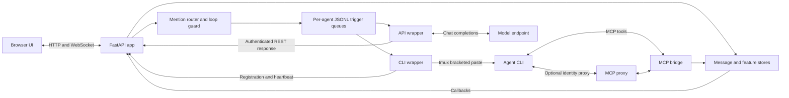

# Architecture review and foundation

This review covers the Python application, browser modules, persistence, launch workflow, and tests at upstream commit `d775776`, plus the foundation changes in this branch. It is based on source inspection and targeted execution, not a penetration test or a workload benchmark.

Subsequent work added an opt-in [native Codex transport](native-codex.md): a wrapper-owned backend, an attachable terminal UI, and a separate durable SQLite notification queue. The tmux and JSONL paths described below remain the defaults.

[Session adoption](session-adoption.md) adds a process-monitoring adapter that connects existing tmux agents without owning them. It uses the same identity registry and durable notification store, a private authenticated CLI chat bridge, and per-instance project/channel metadata. Native adoption observes an existing Codex backend; terminal adoption pins a tmux socket, pane, and process lifetime. Channel membership is checked by the router and at the final trigger boundary.

## What the application does

Agentchattr coordinates independently running agents. It does not host their reasoning or tools. The browser supplies a shared discussion surface; the wrappers translate forum mentions into terminal prompts or model API requests.

Both wrappers and the server must use the same data directory and ports. Queues are files, so this is a same-machine design even though other communication uses HTTP.

### Components and ownership

| Component | Current responsibility | Boundary to retain or improve |
|---|---|---|
| `cli` / `config_loader` | Parse commands, merge settings, resolve paths, select wrapper | One configuration snapshot per process; no provider activity during parsing/help |
| `run` | Configure app, share stores with MCP, start two MCP threads and web server | Eventually own a single runtime lifecycle with readiness and shutdown |
| `app` | HTTP/WS adapters, security, routing orchestration, broadcasts, feature mutations, background jobs | Too many responsibilities; extract services before splitting route files |
| `mcp_bridge` | Tool definitions, identity resolution, presence/activity/cursors/roles, store mutations | Should adapt common application services instead of owning parallel state |
| `registry` | Instance allocation, tokens, claims, renames, reclaimable identities | Useful existing owner for agent identity; keep token-derived identity authoritative |
| `router` / `agents` | Mention targeting, loop guard, queue writes | Routing is already small; replace queue delivery behind an explicit interface later |
| `wrapper` / `wrapper_unix` | Provider config, proxy management, heartbeat, queue polling, terminal injection | Keep provider setup separate from terminal/process lifecycle |
| `wrapper_api` | Read context, invoke chat-completions endpoint, post reply | Shares registration/queue concepts with CLI wrapper but has distinct execution semantics |
| Stores and `archive` | JSON/JSONL persistence, callbacks, export/import | Maintain data formats in this phase; standardize persistence guarantees later |
| `session_engine` / `session_store` | Structured workflows, turn timers, templates and runs | Keep orchestration independent of UI transport |
| Browser scripts | Rendering, input, feature panels, local UI state, HTTP/WS client | Existing `Hub` and `Store` are useful seams; migration away from globals is incomplete |

### A mention and response, step by step

1. A browser connects using its session token. WebSocket messages become `MessageStore` records.
2. Store callbacks schedule a broadcast and `_handle_new_message` on the captured web event loop. System messages bypass routing; human and agent messages encounter the mention router and loop guard.
3. The registry resolves a target to its running instance. `AgentTrigger` appends a JSONL record containing channel/job context to that instance's queue file.
4. The CLI wrapper polls roughly once a second. It reads and clears the queue, constructs an MCP-read prompt, adds role/rule context when applicable, and injects a bracketed paste plus Enter into tmux.
5. The agent calls MCP to read context and respond. A direct provider connection carries its token; providers needing a proxy receive identity injection there. MCP resolves an authenticated token to the actual sender rather than trusting the supplied sender name.
6. The response enters the message store, is broadcast, and may mention another agent. Per-channel hop limits bound automated exchanges; human mentions can resume work.
7. API wrappers consume the same queue concept, read context through REST, invoke their configured model endpoint, and post through authenticated `/api/send` instead of terminal injection.

Registration, heartbeat, activity, and message delivery are separate. A visible activity indicator comes from terminal changes or API request state; it is not proof that a trigger was received or completed.

## Findings addressed in this round

- **Packaging and paths:** Root modules and `sys.path` edits coupled imports to the checkout. A `src/agentchattr` package now owns code, static assets, and built-in templates. Mutable state stays outside the package. Data/upload/cwd paths are normalized by the shared loader, removing differing server/wrapper resolution.
- **Configuration:** Local files previously ignored built-in agent overrides and general settings. Recursive merging now allows personal settings without editing tracked defaults. CLI precedence is applied directly to the loaded config, without mutating process environment variables.
- **Launch and platform duplication:** Per-provider scripts duplicated environment creation, port probing, desktop-terminal selection, and server auto-start. Explicit `serve` and `agent` commands replace them; API-versus-CLI dispatch comes from configuration. Windows injection and macOS-specific launch/open-path branches are removed.
- **Dependency and build reproducibility:** The old three-line requirements file had no lock and relied on transitive packages. Project metadata declares runtime dependencies, a dev group, an optional browser-test group, and a lockfile. Standard source/wheel builds replace a manual ZIP allowlist which omitted the existing archive module.
- **Development checks:** Existing `unittest` coverage is retained and package-aware. Linux CI adds locked installation, Ruff's runtime-error checks, builds, and a clean-wheel smoke test. Documentation is now trackable.
- **Concrete runtime bug:** A function-local `Path` import in `mcp_bridge.chat_send` shadowed its module import, breaking the earlier job-attachment branch. Removing the shadowing import and testing a persisted attachment fixes it.

## Prioritized follow-ups

These findings are deliberately recorded rather than folded into the packaging refactor.

| Priority | Evidence and practical consequence | Suggested next change and acceptance check |
|---|---|---|
| High | `wrapper._queue_watcher` and the API wrapper read then truncate queue files while `AgentTrigger` appends without a cross-process lock. Arrivals between read and truncate can disappear. Failed injection occurs after clearing; a batch collapses multiple contexts into one prompt. | Define delivery/acknowledgement ownership before adding retries. Test concurrent append/consume, mixed channels/jobs, wrapper crashes and partial terminal delivery. Automatic retry must account for potentially duplicated paste. |
| High | `run.main` starts MCP daemon threads; `app.configure` starts presence/schedule loops; wrappers own additional daemon threads and tmux sessions. Startup uses a fixed sleep, not readiness. Non-localhost confirmation happens after MCP threads start. No single owner shuts the full system down. | Combine with the planned tmux/shutdown work: explicit runtime owner, readiness, stop signals, joins, and a policy for existing agents. Test occupied ports, partial startup, Ctrl+C, restart and detached agents. |
| High | Web middleware protects browser APIs, but public prefixes bypass checks, including `/api/roles`; registration is loopback-only. MCP has separate identity rules and accepts non-family supplied identities without a token for compatibility. Registry and provider files persist bearer tokens with normal process file permissions. SVG filtering and Markdown rendering use hand-written escaping. | Audit transport-by-transport authorization and rendering before network exposure. Specify intended anonymous MCP access, protect state-changing routes consistently, test Origin/Host handling, and adopt well-defined HTML/SVG sanitization. These are inspection findings, not a demonstrated remote exploit. |
| Medium | `app` is about 2,700 lines and `mcp_bridge` about 1,000. They import one another; `run` injects store globals; presence and roles live in MCP but are read by web/trigger code. Tests mutate these globals. | Introduce an application runtime object owning stores, identity/presence and routing. Extract one service at a time, with web/MCP parity tests and a test proving two isolated runtimes do not share state. Avoid a wholesale dependency-injection framework. |
| Medium | JSON stores write whole files in place; message edits rewrite JSONL. Locks protect threads inside one process, not multiple server processes. Some loaders/callbacks swallow errors. Registry snapshots already use temporary replacement, so guarantees differ by store. | First standardize atomic write/replace and explicit load/write errors. Test interrupted writes and corrupt files. Consider SQLite only if transactions or multi-process workloads justify a format migration. |
| Medium | Export covers messages, jobs, rules and summaries, but explicitly excludes attachment bytes. It reads stores separately, so it is not a transactional snapshot; settings, schedules and session state are outside that archive contract. | Distinguish portable conversation export from a complete backup. Specify contents and consistency, then add round-trip fixtures for the chosen contract. |
| Medium | `chat.js` is about 4,500 lines and `jobs.js` about 2,100. `Hub`/`Store` exist alongside shared globals and inline event handlers. Most tests exercise Python; the browser script covers voice editing/lifecycle only. | Move one feature at a time behind explicit JS module/state interfaces. Add browser scenarios for messages, jobs, channel switching and reconnect before changing rendering architecture. No framework is required for that step. |
| Medium | Queue/presence loops catch broad exceptions; terminal activity and successful HTTP registration can look healthy despite failed delivery. Comments described a 60-second crash timeout while code uses 15 seconds. | Implement the later communication-logging note with correlated queue, paste, read, send and failure events. Define timeout settings once; test that delivery failures are visible without logging bearer tokens. |

Keep roles, hats, sessions, providers and other user-facing features for now. Removing a feature should include its MCP surface, prompts, persistence, UI, and tests together; deleting a control alone will not reduce agent context.

## Validation and practical limits

The original baseline passed 154 tests with one Windows-only skip. The foundation suite adds configuration, CLI, job-image and subprocess integration coverage; Windows-only execution coverage is removed with the backend.

The subprocess smoke test runs from a temporary directory, loads pre-existing JSONL history, fetches packaged UI assets and four templates, verifies HTTP token enforcement, sends a WebSocket mention, checks its queue record, replies using authenticated MCP, verifies the broadcast and persisted sender, and initializes both HTTP and SSE MCP transports. It also runs against a clean installed wheel. Real tmux tests exercise bracketed paste through a raw terminal reader.

These checks do not establish that every external provider CLI version accepts its generated settings, that a real model follows prompts, or that all browser features are regression-free. No real agent or paid model is launched by the automated checks. Major startup/state/persistence findings remain open as listed above.
